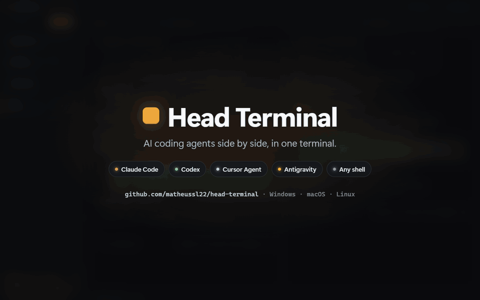

# Head Terminal

<p align="center">
  <strong>All your AI coding agents, side by side.</strong><br>
  Claude Code, Codex, Cursor Agent and more, working at the same time in one window.
</p>

<p align="center">
  
</p>

- 🚀 **A whole team of agents.** Split the screen and give every pane its own agent.
- 👥 **Work and personal accounts.** Each session signs in to its own Claude account.
- 💤 **Minimize, don't stop.** Agents keep working in the background and let you know when they need you or finish.
- 🌳 **No collisions.** A second session on the same repo gets its own copy to work in.

<p align="center">Windows · macOS · Linux · Free for non-commercial use</p>

## Install

macOS (Apple Silicon or Intel), via Homebrew:

```sh
brew install --cask matheussl22/tap/head-terminal
```

Or grab the `.zip` for your architecture from the [latest release](https://github.com/matheussl22/head-terminal/releases/latest) and drag `Head Terminal.app` into Applications. The app is not signed or notarized yet: the cask clears the quarantine flag for you, while a manual download needs `xattr -dr com.apple.quarantine "/Applications/Head Terminal.app"` before the first launch.

Windows and Linux: build from source with `npm ci && npm run make`.

## Feature details

- persisted sessions, pinning, renaming, reordering and quick switching;
- resizable horizontal and vertical splits, each with its own PTY;
- lazy spawn, per-pane restart and scrollback preservation;
- minimizing a pane (the `—` in its header) takes it off the session's area while its agent keeps running: a card in the session says whether it is still working, finished, or stopped on an approval, and brings it back on click. The pty keeps its size meanwhile, so the agent never sees a resize;
- the agent conversation a pane is on is shown in its header, renamable by hand, and the name also applies in the resume list;
- Antigravity, Cursor Agent, Claude Code, Codex and shell profiles;
- multiple Claude accounts, each in its own `~/.head-terminal/claude-profiles/<id>` (the user's own `~/.claude` is never used by a pane, so logging in inside the app never changes the account of a terminal opened outside it);
- automatic `agent-N` Git worktrees, so several agents can work on one repository without fighting over the same working tree;
- search, zoom, links, clipboard and WebGL rendering with fallback;
- activity detection, remaining context, crashes and shell fallback;
- Git context, watcher and diff, including untracked files;
- MCP status for Claude and Cursor;
- voice with local recording and OpenAI transcription;
- notifications, logs, checkpoints and diagnostic export;
- single instance and confirmation before closing working agents.

## License

Head Terminal is free for personal and other non-commercial use under the [PolyForm Noncommercial License 1.0.0](LICENSE.md). Commercial use is not allowed without the author's permission.
